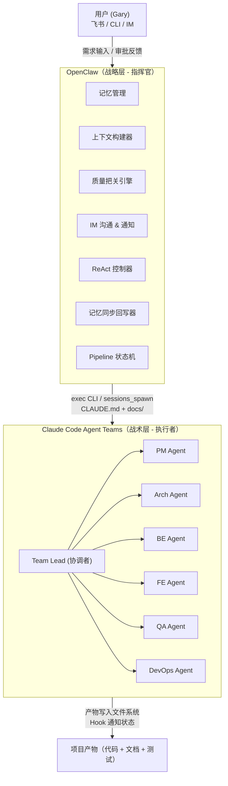
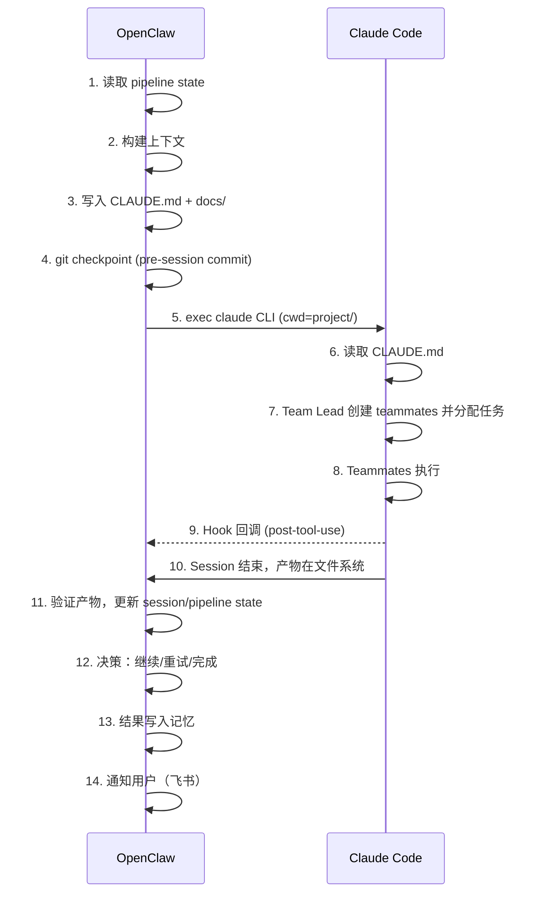

# AIFD 技术方案：AI 全流程研发框架

> **版本：** v0.2  
> **日期：** 2026-03-05  
> **作者：** Gary（架构）+ Claw（细化）

---

## 1. 背景与目标

### 1.1 问题

- **Claude Code 局限**：上下文依赖用户手动输入；单次 LLM 处理有不确定性，需迭代
- **现有 AI 研发工具**：缺乏跨阶段记忆、质量闭环、全流程自动化

### 1.2 机会

- **OpenClaw**：完整记忆体系（历史会话 + 知识库 + 自我学习）、多模型 agents 编排、IM 集成
- **Claude Code Agent Teams**：多 agent 协作机制，Team Lead 通过自然语言指令创建 teammates，teammates 共享项目文件系统

### 1.3 目标

集成 OpenClaw + Claude Code，打造软件工程全自动流水线：需求 → 设计 → 开发 → 测试 → 部署，全程 AI 驱动，人类仅在关键节点审批。

---

## 2. 整体架构



### 2.1 职责划分

| 层级 | 角色 | 职责 |
|------|------|------|
| **战略层** OpenClaw | 指挥官 | 信息采集、上下文构建、协调监控、质量把关、记忆管理、IM 沟通、Pipeline 状态管理 |
| **战术层** Claude Code | 执行者 | 需求分析、产品设计、技术设计、编码、测试、部署 |

### 2.2 技术选型

| 维度 | 当前方案 | 未来演进 |
|------|---------|---------|
| 多 agent 协作 | Claude Code Agent Teams | OpenClaw 原生多 agent |
| 调度 | OpenClaw exec CLI / sessions_spawn | OpenClaw agent 编排引擎 |
| 记忆 | OpenClaw workspace 文件 | 向量化知识库 |
| 质量 | 多模型交叉 Review | 自动化测试 + 形式化验证 |
| 状态管理 | pipeline.json + sessions/ | 持久化状态引擎 |

---

## 3. 项目结构

```
AIFD/
├── .openclaw/
│   ├── agents/                          # OpenClaw agent 定义
│   ├── workspace/                       # 主 agent 工作区
│   │   ├── SOUL.md
│   │   ├── USER.md
│   │   └── MEMORY.md
│   └── workspace-aifd/                  # 全流程研发 agent 工作区
│       ├── SOUL.md                      # 研发指挥官人格
│       ├── USER.md                      # 项目上下文
│       ├── MEMORY.md                    # 跨 session 记忆
│       └── skills/                      # AIFD 专用技能
│           ├── context-builder/         # 上下文构建
│           ├── quality-gate/            # 质量把关
│           └── memory-sync/             # 记忆同步
├── project/
│   ├── .claude/
│   │   ├── settings.json               # Agent Teams 配置
│   │   ├── commands/                    # 自定义命令
│   │   └── hooks/
│   │       └── post-tool-use.sh         # Hook：工具调用后触发
│   ├── CLAUDE.md                        # 动态生成，每次 session 前更新
│   ├── workspace/                       # AI 工作区（状态 + 中间产物）
│   │   ├── pipeline.json               # Feature 级流水线状态
│   │   ├── sessions/                    # Session 状态快照
│   │   │   ├── {session-id}.json
│   │   │   └── latest.json
│   │   └── archive/                     # 已完成 feature 的归档
│   │       └── {feature_id}/
│   ├── docs/
│   │   ├── specs/                       # 全量规格
│   │   │   ├── requirements.md
│   │   │   ├── product.md
│   │   │   ├── tech.md
│   │   │   ├── testing.md
│   │   │   └── deploy.md
│   │   ├── feature001-specs/            # 增量特性规格
│   │   │   ├── requirements.md
│   │   │   ├── design.md
│   │   │   └── review_records/
│   │   └── knowledges/                  # 知识库
│   │       ├── templates/
│   │       ├── best-practices/
│   │       ├── standards/
│   │       ├── domain/
│   │       └── ui-guidelines/
│   ├── frontend/
│   ├── backend/
│   ├── testing/
│   │   ├── integration/
│   │   ├── e2e/
│   │   ├── performance/
│   │   └── reports/
│   └── devops/
```

---

## 4. 协同机制

### 4.1 调用流程



### 4.2 调用方式

OpenClaw 通过两种方式调用 Claude Code：

**方式一：exec CLI（推荐，直接控制）**

```bash
# OpenClaw 通过 exec 工具直接调用 Claude Code CLI
claude --print --dangerously-skip-permissions \
  -p "任务指令..." \
  --model claude-sonnet-4-20250514
```

- 适用场景：大多数任务执行
- OpenClaw 通过 `exec` 工具在 `project/` 目录下运行 Claude Code CLI
- `--print` 模式为非交互式，输出结果后退出
- 环境变量 `CLAUDE_CODE_USE_BEDROCK=1` 等按需设置

**方式二：sessions_spawn（异步执行）**

```javascript
// OpenClaw sessions_spawn，适用于长时间运行的任务
sessions_spawn({
  task: "执行编码任务...",
  runtime: "acp",  // 使用 ACP runtime
  // 或直接用 exec CLI
  command: "claude --print -p '...'",
  cwd: "/path/to/project",
  timeout: 1800000
});
```

- 适用场景：需要异步执行、超时控制的长任务
- `runtime="acp"` 通过 Agent Communication Protocol 调用
- 也可以直接 spawn 一个 exec CLI 进程

> **注意**：具体采用哪种方式取决于 OpenClaw 对 Claude Code 的集成深度。Phase 1 优先验证 exec CLI 方式，确认可行后再评估 ACP runtime 的必要性。

### 4.3 Claude Code Agent Teams 机制

> **重要**：以下描述基于 Claude Code Agent Teams 的官方机制，需在 Phase 1 验证。

**创建 Team**：Team Lead（主 Claude Code 进程）通过**自然语言指令**在对话中创建 teammates。不存在 `--agents` 命令行参数或静态配置文件定义 team。Team Lead 根据 CLAUDE.md 中的任务描述，自行决定创建哪些 teammates。

**Teammate 特性**：
- Teammates 是 Team Lead 创建的子进程，共享项目文件系统
- Teammates 之间通过 Team Lead 协调，不直接通信
- **Teammates 无法跨 session resume**：session 结束后所有 teammate 状态丢失，新 session 需要重新创建 team
- 每个 teammate 有独立的 context window

**Hook 机制**：
- Claude Code 支持在 `.claude/hooks/` 下配置 hook 脚本
- Hook 在特定事件（如工具调用后）触发
- **Hook exit code 2 表示"阻止操作"**——hook 脚本返回 exit code 2 时，Claude Code 会阻止当前操作执行
- Hook 通过 **stdin** 接收 JSON 格式的事件数据，不是命令行参数

**CLAUDE.md 的作用**：
- CLAUDE.md 是 Team Lead 的主要指令来源
- 通过精心构建 CLAUDE.md，OpenClaw 间接控制 Team 的行为
- CLAUDE.md 中描述期望的 team 结构和任务分配，Team Lead 据此创建 teammates

### 4.4 上下文传递

上下文通过**文件系统**传递，不依赖 prompt 塞入：

1. **CLAUDE.md** — 动态生成，包含当前任务指令和项目状态（§7 详述）
2. **docs/** — 规格文档、知识库，Claude Code 按需读取
3. **workspace/** — AI 中间产物和状态文件，跨 session 持久化

### 4.5 跨 Session 状态管理

> 解决核心问题：Claude Code session 是无状态的，每次 spawn 都是全新进程，Agent Teams teammates 无法 resume。需要外置状态管理。

#### 设计原则

1. **Session 无状态**：每次 Claude Code session 视为无状态的执行单元
2. **状态外置**：所有状态通过文件系统持久化（`workspace/pipeline.json` + `workspace/sessions/`）
3. **幂等可重试**：任何 session 可安全重试，通过 git checkpoint 保证
4. **增量推进**：大任务拆分为子任务，每个子任务一个 session，失败不影响已完成部分

#### Session State Snapshot

每次 session 前后写入结构化状态到 `workspace/sessions/`：

```json
{
  "session_id": "2026-03-05-001",
  "feature": "feature001",
  "pipeline_stage": "P4",
  "sub_task": "backend-api-user-crud",
  "status": "completed|failed|timeout|partial",
  "started_at": "2026-03-05T10:00:00Z",
  "ended_at": "2026-03-05T10:25:00Z",
  "artifacts_produced": [
    "backend/src/api/users.py",
    "backend/src/models/user.py"
  ],
  "artifacts_validated": true,
  "pending_work": [
    "backend/src/api/users.py 中的 DELETE 端点未实现"
  ],
  "error": null,
  "retry_count": 0,
  "git_checkpoint": "abc123"
}
```

#### Pipeline State Machine

`workspace/pipeline.json` 管理 feature 级的阶段流转：

```json
{
  "feature": "feature001",
  "current_stage": "P4",
  "stages": {
    "P1": {"status": "done", "completed_at": "...", "artifacts": ["docs/feature001-specs/requirements.md"]},
    "P2": {"status": "done", "completed_at": "...", "artifacts": ["docs/feature001-specs/product.md"]},
    "P3": {"status": "done", "completed_at": "...", "artifacts": ["docs/feature001-specs/tech.md"]},
    "P4": {"status": "in_progress", "sub_tasks": [
      {"id": "backend-api", "status": "done"},
      {"id": "frontend-pages", "status": "in_progress", "current_session": "2026-03-05-003"},
      {"id": "frontend-state", "status": "todo"}
    ]},
    "P5": {"status": "pending"},
    "P6": {"status": "pending"}
  },
  "rollback_history": []
}
```

#### 阶段流转规则

```python
def next_action(pipeline):
    stage = pipeline["stages"][pipeline["current_stage"]]

    if stage["status"] == "in_progress":
        # 找到第一个未完成的 sub_task
        for task in stage.get("sub_tasks", []):
            if task["status"] in ("todo", "in_progress", "failed"):
                return {"action": "spawn_session", "task": task}
        # 所有 sub_task 完成 → 触发质量门
        return {"action": "quality_gate", "stage": pipeline["current_stage"]}

    if stage["status"] == "review_failed":
        if stage.get("retry_count", 0) >= 3:
            return {"action": "escalate_to_human"}
        return {"action": "retry_with_feedback", "feedback": stage["review_feedback"]}

    if stage["status"] == "done":
        next_stage = get_next_stage(pipeline["current_stage"])
        return {"action": "advance", "to": next_stage}
```

#### 跨阶段回退

当 Review 发现上游阶段产物有问题时，支持回退：

```python
def rollback(pipeline, target_stage, reason):
    current = pipeline["current_stage"]
    pipeline["rollback_history"].append({
        "from": current, "to": target_stage,
        "reason": reason, "timestamp": now()
    })
    # target_stage 及之后的阶段标记为需要重做
    for stage in stages_from(target_stage):
        pipeline["stages"][stage]["status"] = "needs_redo"
    pipeline["current_stage"] = target_stage
```

#### Session 生命周期

1. **Pre-session**：`git add -A && git commit` 存档 → 读取 pipeline state → 构建 CLAUDE.md
2. **In-session**：Claude Code 执行，产物写入文件系统
3. **Post-session**：验证产物 → 更新 session state → 更新 pipeline state → 同步记忆
4. **Recovery**：根据退出状态决定重试/拆分/升级

#### Session 恢复策略

```
Session 结束
    │
    ├── 正常退出（exit 0）
    │   ├── 产物完整 → status=completed, git commit
    │   └── 产物不完整 → status=partial, 记录 pending_work
    │
    ├── 超时（30min kill）
    │   ├── 已产出文件可用 → status=partial, 保留可用产物
    │   └── 文件损坏 → status=failed, git reset --hard 到 checkpoint
    │
    └── 异常退出（crash/error）
        ├── 有改动且可用 → git stash, 标记 status=failed
        └── 无改动或不可用 → git reset, 直接重试
        └── retry_count > 3 → 升级为人工介入
```

#### Workspace 清理

每个 feature 完成后，归档状态文件：
- `workspace/sessions/*.json` → `workspace/archive/{feature_id}/`
- 追加式日志文件归档后清空
- 保留最近 N 个 session 的详细记录

### 4.6 结果接收

- **产物**：直接写入 `project/` 目录（代码、文档、测试）
- **状态**：通过 Hook 脚本 + session state 文件
- **卡点**：写入 session state 的 `pending_work`，OpenClaw 在 post-session 阶段处理

---

## 5. 上下文构建流程

OpenClaw 在每次调用 Claude Code 前，动态构建上下文：

```
┌─────────────────────────────────────────┐
│         上下文构建器 (Context Builder)     │
│                                         │
│  输入源：                                │
│  ├── MEMORY.md（长期记忆）               │
│  ├── memory/YYYY-MM-DD.md（近期日志）     │
│  ├── docs/specs/*（现有规格）             │
│  ├── docs/knowledges/*（知识库）          │
│  ├── pipeline.json（当前流水线状态）       │
│  ├── sessions/latest.json（上次执行状态） │
│  ├── 用户本次需求                        │
│  └── 上一轮执行结果（如有）               │
│                                         │
│  输出：                                  │
│  ├── CLAUDE.md（动态生成）               │
│  ├── docs/featureXXX-specs/（特性规格）   │
│  └── pipeline.json 更新                  │
└─────────────────────────────────────────┘
```

### 5.1 构建步骤

1. **读取 Pipeline 状态**：确定当前阶段、子任务、上次 session 结果
2. **提取相关记忆**：从 MEMORY.md 中筛选与当前任务相关的经验、偏好、历史决策
3. **加载知识库**：根据任务类型加载对应模板和标准（如后端任务加载 `best-practices/backend.md`）
4. **汇总项目状态**：读取现有 specs、代码结构、测试覆盖率等
5. **生成 CLAUDE.md**：将以上信息结构化写入（§7 详述）
6. **准备特性规格**：如为增量特性，创建 `featureXXX-specs/` 并填充需求模板

### 5.2 上下文裁剪策略

Claude Code 的 context window 有限，需按优先级裁剪：

| 优先级 | 内容 | 策略 |
|--------|------|------|
| P0 | 当前任务指令 + session 连续性信息 | 始终包含 |
| P1 | 直接相关的 spec 文档 | 全量包含 |
| P2 | 相关知识库 | 摘要 + 文件路径引用 |
| P3 | 历史经验 | 仅相关条目 |
| P4 | 项目全局信息 | 概要 |

---

## 6. ReAct-Loop 机制

### 6.1 整体循环

```
         ┌──────────────────────────────┐
         │                              │
         ▼                              │
  ┌─────────────┐    ┌──────────┐    ┌──┴───────┐
  │ 构建上下文   │───►│ 执行      │───►│ 评估     │
  │ (Reason)    │    │ (Act)    │    │ (Judge)  │
  └─────────────┘    └──────────┘    └──┬───────┘
                                        │
                              ┌─────────┴────────┐
                              │                  │
                         通过 ✓              不通过 ✗
                              │                  │
                         ┌────▼────┐      ┌──────▼─────┐
                         │ 完成    │      │ 生成修正   │
                         │ & 记忆  │      │ 指令       │──► 回到构建上下文
                         └─────────┘      └────────────┘
```

### 6.2 迭代参数

| 参数 | 值 | 说明 |
|------|---|------|
| 最大轮次 | 3 | 超过则人工介入 |
| 超时 | 30min/轮 | 单轮执行超时 |
| 评估模型 | 与执行模型不同 | 交叉验证，避免自我强化 |

### 6.3 评估标准

每轮结束后，OpenClaw 用**不同模型**评估产物：

```json
{
  "completeness": "所有需求点是否覆盖",
  "correctness": "逻辑/语法/类型是否正确",
  "consistency": "与现有架构/规范是否一致",
  "quality": "代码质量/文档质量评分 (1-10)",
  "blockers": ["具体阻塞项列表"]
}
```

- **评分 ≥ 7 且无 blockers** → 通过
- **评分 < 7 或有 blockers** → 生成修正指令，进入下一轮
- **连续 2 轮无改善** → 升级为人工介入

### 6.4 Session 级重试（区别于 Review 重试）

```
Session 执行层
    │
    ├── 成功完成 → 进入质量 Review (ReAct)
    │   ├── 通过 → 下一步
    │   └── 不通过 → 修正重做 (ReAct 轮次)
    │
    └── 失败/超时 → Session 恢复
        ├── 重试 ≤ 3 → 更新 CLAUDE.md 含错误信息，重新 spawn
        └── 重试 > 3 → 升级为人工介入
```

Session 级重试和 Review 重试是两个独立维度：
- **Session 重试**：处理进程崩溃、超时等执行层问题
- **Review 重试**：处理产物质量不达标的问题

### 6.5 大任务拆分机制

对于编码等复杂阶段，单个 session（30min）可能不够完成全部工作。OpenClaw 在上下文构建阶段增加任务拆分步骤：

**拆分流程**：
1. OpenClaw 用轻量模型分析 tech spec，将编码任务拆分为子任务
2. 每个子任务满足：单次 session（≤25min）可完成、产物边界清晰（具体文件列表）、依赖关系明确
3. 按依赖关系拓扑排序
4. 写入 `pipeline.json` 的 `sub_tasks` 字段

**子任务间上下文传递**：每个子任务的 CLAUDE.md 中包含已完成子任务的产物摘要：

```markdown
## 已完成的相关子任务
- [backend-api] 已完成，产物：backend/src/api/users.py
  - 关键接口：GET/POST/PUT /api/users, 认证用 JWT
- [backend-models] 已完成，产物：backend/src/models/user.py
  - User model 字段：id, email, name, hashed_password, created_at

## 当前子任务
- [frontend-pages] 实现用户管理页面
  - 依赖上述 API 接口
  - 输出到 frontend/src/pages/users/
```

---

## 7. CLAUDE.md 动态生成

CLAUDE.md 在每次 session 前由 OpenClaw 生成，结构如下：

```markdown
# CLAUDE.md

## 项目概述
{从 docs/specs/ 提取的项目摘要}

## Session 连续性
### 上一 Session 状态
- Session ID: {session_id}
- 状态: {completed|partial|retry}
- 已完成: {已产出的文件列表}
- 未完成: {pending_work 详细描述}

### 当前 Session 范围
- 子任务: {sub_task_id}
- 目标: {具体目标，不含已完成部分}
- 预期产物: {文件列表}
- 时间预算: {estimated_minutes} 分钟

## 当前任务
### 目标
{本次 session 的具体目标}

### 输入
{需要读取的文件列表和说明}

### 输出要求
{期望的产物、格式、存放路径}

### 约束
{技术栈限制、编码规范、性能要求}

## Team 配置建议
### Team 目标
{希望 Team Lead 如何组织协作}

### 建议的 Teammate 角色
{描述期望的 teammate 分工，Team Lead 据此创建 teammates}

## 质量标准
{本次任务的验收标准}

## 上下文
### 项目状态
{当前进度、已完成模块、待处理项}

### 相关经验
{从 MEMORY.md 提取的相关历史经验}

### 已知问题
{上一轮的 blockers 和修正指令（如有）}

## 知识库引用
- 编码规范: docs/knowledges/standards/coding.md
- UI 指南: docs/knowledges/ui-guidelines/
- 领域知识: docs/knowledges/domain/
{按需列出，Claude Code 按需读取}
```

> **注意**：CLAUDE.md 中不直接定义 agent 配置文件。Agent Teams 的 teammates 由 Team Lead 在运行时根据 CLAUDE.md 描述的任务需要自行创建。

---

## 8. Hooks 设计

### 8.1 Hook 机制说明

Claude Code Hooks 通过 `.claude/settings.json` 配置，在特定事件触发时执行 shell 脚本。

**关键机制**：
- Hook 脚本通过 **stdin** 接收 JSON 格式的事件数据（不是命令行参数）
- **Exit code 0**：允许操作继续
- **Exit code 2**：阻止当前操作（可用于实现安全防护）
- 其他非零 exit code：Hook 失败但不阻止操作

> **Phase 1 验证项**：上述机制基于 Claude Code 文档，需在 Phase 1 第一时间验证 Hook 的实际行为和参数传递方式。

### 8.2 post-tool-use Hook

在工具调用完成后触发，用于记录状态和质量检查：

```bash
#!/bin/bash
# .claude/hooks/post-tool-use.sh
# 注意：具体事件数据格式需 Phase 1 验证

# 从 stdin 读取事件数据
EVENT_DATA=$(cat)

# 记录事件
echo "$EVENT_DATA" >> workspace/hook-events.jsonl

# 检查是否为文件写入操作，记录产物
TOOL=$(echo "$EVENT_DATA" | jq -r '.tool // empty')
if [ "$TOOL" = "write" ] || [ "$TOOL" = "edit" ]; then
  FILE=$(echo "$EVENT_DATA" | jq -r '.file // empty')
  if [ -n "$FILE" ]; then
    echo "{\"artifact\": \"$FILE\", \"timestamp\": \"$(date -u +%Y-%m-%dT%H:%M:%SZ)\"}" >> workspace/artifacts.jsonl
  fi
fi

exit 0  # 允许操作继续
```

### 8.3 OpenClaw 侧的状态监控

OpenClaw 在 session 结束后（而非实时监控）处理状态：

```
Session 结束
  → 读取 workspace/hook-events.jsonl
  → 读取 workspace/artifacts.jsonl
  → 验证产物完整性
  → 更新 session state 和 pipeline state
  → 触发质量把关（如需要）
  → 清理 hook 日志文件
```

---

## 9. 质量把关流程

### 9.1 Review 触发阶段

| 阶段 | 产物 | Review 类型 | Review 级别 |
|------|------|------------|------------|
| 需求分析 | requirements.md | 完整性 + 一致性 | 简化（单模型） |
| 产品设计 | product.md | 可行性 + 用户价值 | 简化（单模型） |
| 技术设计 | tech.md | 架构合理性 + 可维护性 | **完整（多模型）** |
| 编码实现 | 源代码 | 代码质量 + 规范一致性 | **完整（多模型）** |
| 测试 | 测试代码 + 报告 | 覆盖率 + 边界场景 | 简化（单模型） |

### 9.2 简化 Review（单模型，适用于文档类产物）

用一个与执行模型不同的模型评估产物，输出结构化 Review 报告。适用于 P1、P2、P5 等阶段。

### 9.3 完整 Review（多模型，适用于关键节点）

仅在关键节点（P3 技术设计、P4 编码完成）启用：

```
阶段 1: 并行生成
  ├── 模型 A (Claude) ──► Review 意见 A
  └── 模型 B (GPT/GLM) ─► Review 意见 B

阶段 2: 合并
  └── 合并模型
      输入: 意见 A + B + 原始产物
      输出: 合并意见（去重、排优先级、标记 must-fix / should-fix / nice-to-have）
```

> **演进路径**：Phase 1-2 全部用单模型 Review。Phase 3 在关键节点引入 2 模型并行 + 合并。Phase 5 可扩展到完整 5 阶段（加入自审 + 交叉验证），但需评估成本收益。

### 9.4 Review 报告格式

```json
{
  "stage": "tech-design",
  "timestamp": "2026-03-05T10:00:00Z",
  "models_used": ["claude-opus-4"],
  "review_level": "simple|full",
  "verdict": "pass|conditional_pass|fail",
  "must_fix": [
    {"id": "MF-001", "description": "...", "location": "tech.md#L42"}
  ],
  "should_fix": [],
  "nice_to_have": [],
  "score": 7.5
}
```

---

## 10. 记忆同步机制

### 10.1 回写触发

| 触发条件 | 回写内容 |
|----------|---------|
| session 完成 | 任务摘要、耗时、成功/失败 |
| 遇到卡点并解决 | 问题描述 + 解决方案 |
| Review 不通过 | 失败原因 + 修正方案 |
| 新发现的 pattern | 最佳实践 / 反模式 |

### 10.2 回写流程

```
Claude Code session 结束
       │
       ▼
OpenClaw 读取 workspace/ 下的产物和日志
       │
       ▼
提取关键信息（用轻量模型摘要）
       │
       ├──► memory/YYYY-MM-DD.md  （当日日志）
       ├──► MEMORY.md             （长期记忆，重要经验）
       └──► docs/knowledges/      （通用知识，可复用）
```

### 10.3 知识库冷启动

不要试图在项目开始前填满知识库。冷启动策略：
- Phase 1 用最小知识库：1 个编码规范 + 1 个 API 设计模板
- 每次 session 的经验自动归纳写入知识库
- 随项目推进逐步积累

### 10.4 记忆结构

```markdown
# MEMORY.md (AIFD agent)

## 项目经验
### [2026-03-05] feature001 - 用户管理模块
- 技术栈：FastAPI + React，前后端分离
- 卡点：CORS 配置问题，解决方案见 knowledges/best-practices/cors.md
- 教训：应在 tech spec 阶段明确跨域策略

## Agent 协作经验
- PM agent 产出的需求容易遗漏非功能性需求 → 在模板中增加检查项
- BE 和 FE agent 并行开发时需要先对齐 API 契约

## 质量经验
- GLM 在代码 review 中倾向于关注格式问题，Claude 更关注逻辑 → 互补
```

---

## 11. 完整工作流：端到端

### 11.1 流程总览

```
用户需求 ──► [P1 需求分析] ──► [P2 产品设计] ──► [P3 技术设计]
                                                       │
              [P6 部署上线] ◄── [P5 测试验证] ◄── [P4 编码实现]
```

### 11.2 各阶段详细

#### P1: 需求分析

| 项 | 内容 |
|----|------|
| **触发** | 用户在飞书描述需求 |
| **OpenClaw** | 解析需求 → 查记忆中类似项目经验 → 构建上下文 → 生成 CLAUDE.md |
| **Claude Code** | Team Lead 根据 CLAUDE.md 创建 PM 角色的 teammate |
| **PM Teammate** | 读取需求 → 输出 `requirements.md`（功能需求 + 非功能需求 + 验收标准） |
| **质量门** | 单模型 Review requirements.md 的完整性 |
| **产物** | `docs/featureXXX-specs/requirements.md` |
| **人工节点** | 需求确认（飞书通知 Gary 审批） |

#### P2: 产品设计

| 项 | 内容 |
|----|------|
| **OpenClaw** | 加载 requirements.md + UI guidelines → 更新 CLAUDE.md |
| **Claude Code** | PM 角色 teammate 输出产品设计 |
| **产物** | `product.md`（用户故事、页面流程、交互说明） |
| **质量门** | 单模型 Review 产品设计与需求的一致性 |

#### P3: 技术设计

| 项 | 内容 |
|----|------|
| **OpenClaw** | 加载 product.md + best-practices + domain knowledge → 更新 CLAUDE.md |
| **Claude Code** | Team Lead 创建 Arch、BE、FE 角色的 teammates 协作 |
| **产物** | `tech.md`（架构、API 设计、数据模型、技术选型） |
| **质量门** | **完整多模型 Review**（架构合理性、可扩展性、一致性） |
| **人工节点** | 技术方案审批 |

#### P4: 编码实现

| 项 | 内容 |
|----|------|
| **OpenClaw** | 加载 tech.md → **拆分为子任务** → 按拓扑排序编排 → 更新 CLAUDE.md |
| **Claude Code** | 每个子任务一个 session，Team Lead 创建 BE/FE teammates 并行开发 |
| **产物** | `backend/` + `frontend/` 源代码 |
| **质量门** | **完整多模型 Review**（逻辑正确性 + 规范一致性） |
| **ReAct** | 如 Review 不通过，自动修正（最多 3 轮） |

#### P5: 测试验证

| 项 | 内容 |
|----|------|
| **OpenClaw** | 加载 requirements.md + 代码 → 更新 CLAUDE.md |
| **Claude Code** | QA 角色 teammate 编写并执行测试 |
| **产物** | `testing/` 目录（单测 + 集成 + E2E + 报告） |
| **质量门** | 测试覆盖率 ≥ 80%，关键路径 100% |

#### P6: 部署上线

| 项 | 内容 |
|----|------|
| **OpenClaw** | 加载 deploy spec + devops 配置 → 更新 CLAUDE.md |
| **Claude Code** | DevOps 角色 teammate 生成部署配置 |
| **产物** | `devops/`（Dockerfile、CI/CD 配置、部署脚本） |
| **人工节点** | 部署确认 |

### 11.3 Agent 角色说明

| 角色 | 主要阶段 | 关键技能 | 说明 |
|------|---------|---------|------|
| PM | P1, P2 | 需求分析、用户故事、验收标准 | 由 Team Lead 按需创建 |
| Arch | P3 | 系统设计、API 设计、技术选型 | 由 Team Lead 按需创建 |
| BE | P3, P4 | 后端编码、API 实现、数据库 | 由 Team Lead 按需创建 |
| FE | P3, P4 | 前端编码、组件开发、状态管理 | 由 Team Lead 按需创建 |
| QA | P5 | 测试用例、自动化测试、缺陷分析 | 由 Team Lead 按需创建 |
| DevOps | P6 | CI/CD、容器化、部署自动化 | 由 Team Lead 按需创建 |

> **注意**：这些角色不是预定义的 agent 配置文件，而是 CLAUDE.md 中描述的期望分工。Team Lead 根据任务需要自行决定创建哪些 teammates 以及如何分配工作。

---

## 12. 实施路径

### Phase 1: 基础验证（1-2 周）

**目标**：验证 OpenClaw ↔ Claude Code 协同可行性

- [ ] **验证 Hook 实际行为**（最高优先级）：用最简脚本测试 Hook 触发方式、stdin 数据格式、exit code 语义
- [ ] **验证 Agent Teams 创建机制**：确认 Team Lead 通过自然语言创建 teammates 的行为
- [ ] 搭建项目结构
- [ ] 实现 CLAUDE.md 动态生成（简单版，手动模板）
- [ ] 通过 exec CLI 调用 Claude Code 完成单个任务（如生成一个 API 的 tech spec）
- [ ] 实现 git checkpoint 机制（pre-session commit + post-session commit/reset）
- [ ] 引入 session state 文件（workspace/sessions/）
- [ ] 验证结果回写 memory

**验收**：能通过 OpenClaw 指令触发 Claude Code 完成一个 spec 文档，含 git checkpoint 和 session state 记录

### Phase 2: 单阶段闭环（2-3 周）

**目标**：实现单个阶段的 ReAct-Loop 闭环

- [ ] 实现上下文构建器（从记忆 + 知识库 + pipeline state 构建）
- [ ] 实现 pipeline.json 状态机（单 feature，P1 阶段）
- [ ] 实现质量把关（单模型 Review → 通过/修正）
- [ ] 实现 ReAct-Loop（执行 → 评估 → 修正，最多 3 轮）
- [ ] 实现 session 恢复逻辑（正常/超时/崩溃三种路径）
- [ ] 实现 IM 通知（飞书通知审批节点）

**验收**：从需求描述到 requirements.md 全自动，含质量 Review、session 恢复和必要修正

### Phase 3: 多阶段串联（3-4 周）

**目标**：实现 P1 → P3 的多阶段流水线

- [ ] 实现阶段间的上下文传递
- [ ] Pipeline 状态机扩展到 P1→P3
- [ ] 实现大任务拆分（为 P4 编码阶段准备）
- [ ] 实现多模型 Review（2 模型并行 + 合并，仅 P3）
- [ ] 实现人工审批节点
- [ ] 实现跨阶段回退

**验收**：从需求到技术设计全自动流水线

### Phase 4: 全流程贯通（4-6 周）

**目标**：P1 → P6 全流程

- [ ] P4 编码阶段子任务化 + 多 session 执行
- [ ] P5 测试自动执行和覆盖率检查
- [ ] P6 部署配置生成
- [ ] 完善知识库（随 session 经验自动积累）
- [ ] 完善记忆同步（经验自动归纳）
- [ ] 多 feature 并行支持（pipeline.json → pipelines/{feature_id}.json）

**验收**：一个中等复杂度的功能模块，从需求到部署配置全自动

### Phase 5: 优化迭代（持续）

- 多模型 Review 可选升级到 5 阶段完整流程（评估成本收益后决定）
- 知识库向量化检索
- 性能优化（并行度、上下文裁剪）
- 可观测性（执行时间线、token 消耗追踪、成功率统计）
- 探索 OpenClaw 原生多 agent 替代 Claude Code Agent Teams

---

## 13. 风险与应对

| 风险 | 影响 | 概率 | 应对 |
|------|------|------|------|
| **Agent Teams 实验性功能不稳定** | 执行中断、结果不可靠 | 高 | 每个 session 做幂等设计（git checkpoint）；关键产物实时写入文件系统 |
| **Agent Teams teammates 无法跨 session resume** | 每次 session 都是全新 Team，需从文件重建上下文 | 确定 | CLAUDE.md 包含 session 连续性信息；大任务拆分为原子子任务；产物实时写入文件系统 |
| **上下文窗口不足** | 复杂任务信息丢失 | 中 | 分层裁剪策略（§5.2）；大任务拆分为子任务 |
| **单 session 30min 超时不够** | 编码等复杂任务无法完成 | 高 | 大任务拆分机制（§6.5）；子任务粒度控制在 ≤25min |
| **多模型 Review 意见冲突** | 难以判断哪个意见正确 | 中 | 引入合并模型仲裁；最终以可验证的标准（测试通过、类型检查）为准 |
| **记忆膨胀** | 上下文构建变慢、噪音增加 | 中 | 定期归纳压缩；workspace 清理归档（§4.5） |
| **Claude Code API 成本** | 多轮迭代 + 多模型 Review 成本高 | 高 | Phase 1-2 用单模型 Review；轻量任务用便宜模型；按阶段分级 Review 级别（§9.1） |
| **阶段间耦合** | 上游变更导致下游返工 | 中 | 跨阶段回退机制（§4.5）；增量更新而非全量重做 |
| **Hook 机制与预期不符** | Hook 脚本无法正常工作 | 中 | Phase 1 第一优先级验证 Hook 行为；备选方案：纯文件系统轮询 |

---

## 14. 关键设计决策记录

| # | 决策 | 理由 | 替代方案 |
|---|------|------|---------|
| D1 | 上下文通过文件系统传递而非 prompt | Claude Code 自带文件读取能力；避免 prompt 过长；支持增量更新 | 全量 prompt 注入 |
| D2 | OpenClaw 做质量评估而非 Claude Code 自评 | 避免模型自我强化偏差；支持多模型交叉 | 在 Agent Team 内加 Review Agent |
| D3 | Hook 通过文件系统通信 | 简单可靠；Hook 写文件 + OpenClaw post-session 读取 | WebSocket / HTTP 回调 |
| D4 | 分阶段实施而非一次性搭建 | 降低风险；每阶段可独立验证价值 | 完整实现后再验证 |
| D5 | 保留 Claude Code Agent Teams 作为当前方案 | 成熟度高于自建多 agent；减少开发量 | 直接用 OpenClaw 多 agent |
| D6 | 每次 session 都是新 Claude Code 进程 | Agent Teams teammates 无法 resume；新 session + 文件传递更可靠 | --resume 模式（仅 Team Lead 可 resume，不含 teammates） |
| D7 | git checkpoint 实现幂等 | 简单可靠；支持任意回滚；不依赖 Claude Code 内部机制 | 文件级 snapshot/备份 |
| D8 | pipeline state 用单文件 JSON | 与方案整体的文件系统通信风格一致；简单场景足够；可迁移到 DB | SQLite / 外部数据库 |
| D9 | 大任务拆分由 OpenClaw 用轻量模型完成 | 拆分是战略决策，属于 OpenClaw 职责；避免浪费 Claude Code 的 context | 在 Claude Code Team 内部拆分 |
| D10 | 质量 Review 按阶段分级 | 文档类产物单模型足够；关键节点才需多模型；控制成本 | 所有阶段统一流程 |

---

## 附录 A: CLAUDE.md 中的 Team 配置示例

> Agent Teams 的 teammates 不通过配置文件定义，而是 Team Lead 在运行时根据 CLAUDE.md 描述创建。以下是 CLAUDE.md 中"Team 配置建议"段落的示例。

### P3 技术设计阶段的 Team 配置建议

```markdown
## Team 配置建议

### Team 目标
完成 feature001 的技术设计文档，输出 docs/feature001-specs/tech.md。

### 建议的 Teammate 分工
请创建以下 teammates 协作完成：

1. **架构师**：负责整体架构设计、技术选型决策。读取 requirements.md 和 product.md，
   输出 tech.md 的架构部分（系统架构图、模块划分、技术栈选择）。
   参考 docs/knowledges/best-practices/ 中的最佳实践。

2. **后端设计**：负责 API 设计和数据模型。输出 tech.md 的 API 定义和数据库 schema 部分。
   遵循 RESTful 规范，参考 docs/knowledges/standards/api-design.md。

3. **前端设计**：负责前端架构和组件设计。输出 tech.md 的前端架构部分。
   参考 docs/knowledges/ui-guidelines/。

### 协作要求
- 架构师先完成整体架构，后端和前端再并行细化
- 后端和前端需对齐 API 契约
- 最终由架构师汇总审核 tech.md
```

### P4 编码阶段的 Team 配置建议

```markdown
## Team 配置建议

### Team 目标
完成子任务 [backend-api]：实现用户管理 API。

### 建议的 Teammate 分工
这是一个原子子任务，建议创建一个后端开发 teammate 独立完成：

1. **后端开发**：根据 tech.md 中的 API 定义，实现以下端点：
   - GET /api/users - 用户列表
   - POST /api/users - 创建用户
   - PUT /api/users/:id - 更新用户
   - DELETE /api/users/:id - 删除用户
   输出到 backend/src/api/users.py 和 backend/src/models/user.py。

### 约束
- 使用 FastAPI 框架
- 认证使用 JWT
- 遵循 docs/knowledges/standards/coding.md
```

---

## 变更记录

### v0.2 (2026-03-05)

基于 Review 报告（REVIEW_REPORT.md）和跨会话分析（CROSS_SESSION_ANALYSIS.md）修改。

**Must-Fix 修改：**

| 编号 | 问题 | 修改内容 |
|------|------|---------|
| MF-1 | 缺少跨 Session 状态管理 | 新增 §4.5，包含 Session State Snapshot、Pipeline State Machine、阶段流转规则、跨阶段回退、Session 恢复策略、Workspace 清理 |
| MF-2 | Agent Teams session resume 限制未提及 | §4.3 明确说明 teammates 无法跨 session resume；§13 风险表新增此项；§14 新增 D6 决策 |
| MF-3 | 大任务拆分机制空白 | 新增 §6.5 大任务拆分机制；§11.2 P4 阶段增加子任务编排描述；§14 新增 D9 决策 |
| MF-4 | Hooks 机制描述与实际不符 | 重写 §8，改为 stdin 接收 JSON 数据；明确 exit code 2 的阻止语义；标注 Phase 1 需验证 |

**Should-Fix 修改：**

| 编号 | 问题 | 修改内容 |
|------|------|---------|
| SF-1 | 幂等/恢复策略缺少具体机制 | §4.5 增加 git checkpoint 方案和 Session 恢复策略 |
| SF-2 | workspace/ 文件无清理机制 | §4.5 增加 Workspace 清理段落 |
| SF-3 | 质量把关 5 阶段流程过重 | 重写 §9，按阶段分级 Review 级别（简化 vs 完整）；默认用简化版；§14 新增 D10 |
| SF-4 | Agent 定义文件过于简单 | 重写附录 A，改为 CLAUDE.md 中的 Team 配置示例（而非独立 agent 配置文件） |
| SF-5 | 多 feature 并行未设计 | §12 Phase 4 增加 pipelines/{feature_id}.json 多 feature 支持 |

**其他改进：**

- §2 架构图改为 Mermaid 格式（NH-4）
- §4.2 明确 OpenClaw 调用 Claude Code 的两种方式（exec CLI vs sessions_spawn）
- §4.3 新增 Claude Code Agent Teams 机制详述，确保与官方机制一致
- §5 上下文构建增加 pipeline state 和 session state 作为输入源
- §10.3 新增知识库冷启动策略（NH-3）
- §12 各 Phase 增加验证项和更具体的任务
- §13 风险表增加 Hook 机制不符预期、session 超时两个风险项
- 项目结构（§3）增加 workspace/pipeline.json、workspace/sessions/、workspace/archive/
- 移除了不存在的 `.claude/agents/` 目录和 `.claude/hooks/TeammateIdle.sh` 等
- 版本号从 v0.1 draft 更新��� v0.2

---

*文档结束。随项目推进持续更新。*
